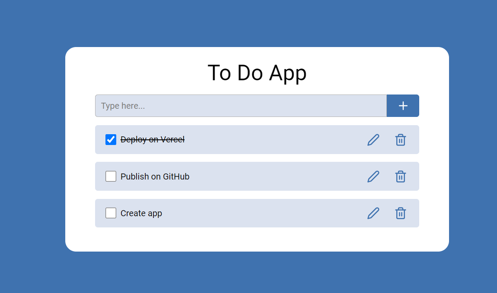

<!-- PROJECT LOGO -->
<br />
<div align="center">
  <h1 align="center">Todolist</h1>

  <p align="center">
    Todolist created with react, typescript, zustand and vite.js
		<br/>
		<a href="https://todolist-sooty-ten.vercel.app/">View Demo</a>
  </p>
</div>


<!-- ABOUT THE PROJECT -->
## About The Project

A simple todo list

### Built With

<p>ReactJs</p>
<p>TypeScript</p>
<p>Zustand</p>

<div align="center">
  <span>
    
   </span>
</div>

<!-- GETTING STARTED -->
### Installation

1. Clone the repo
   ```sh
   git clone https://github.com/Regina5425/todolist-react-ts-zustand.git
   ```
2. Install NPM packages
   ```sh
   npm install
   ```
3. Run the app on your localhost
   ```js
   npm run dev
   ```

<!-- CONTACT -->
## Contact

Regina - reina5425@gmail.com

Project Link: [https://github.com/Regina5425/todolist-react-ts-zustand](https://github.com/Regina5425/todolist-react-ts-zustand)
